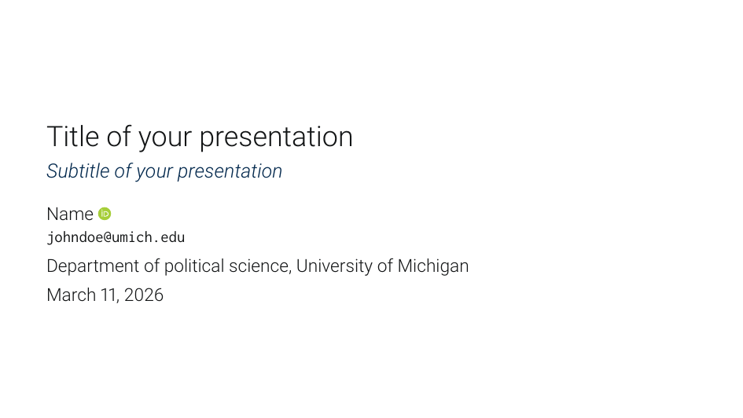
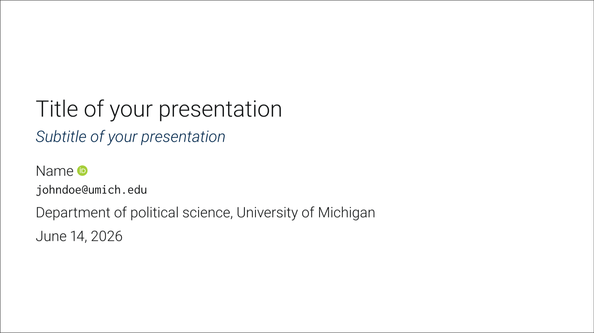
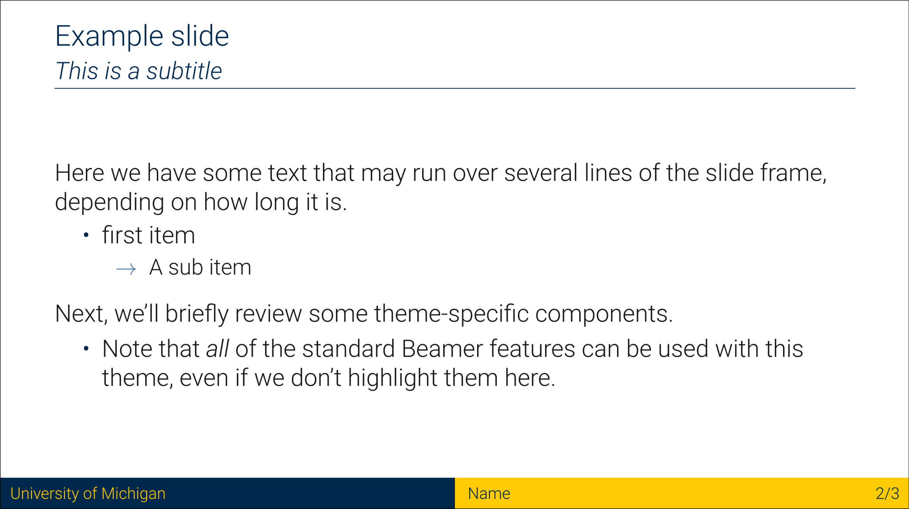
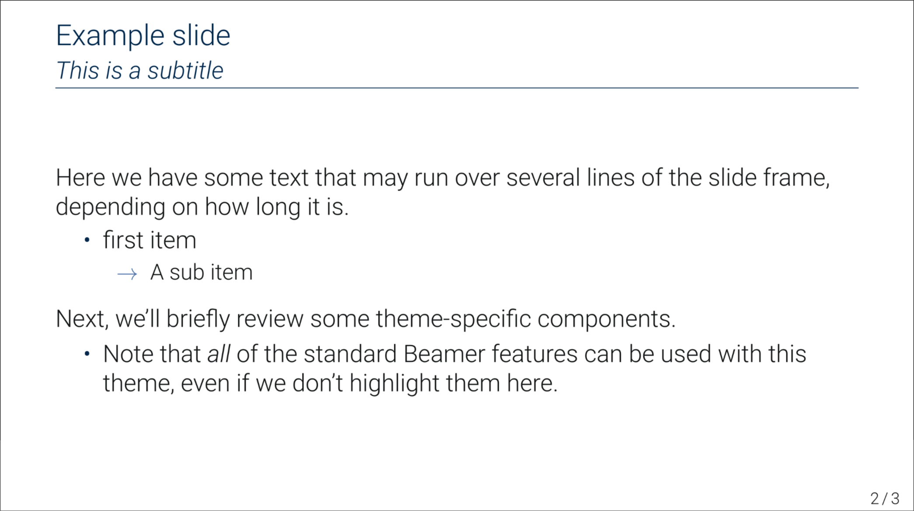
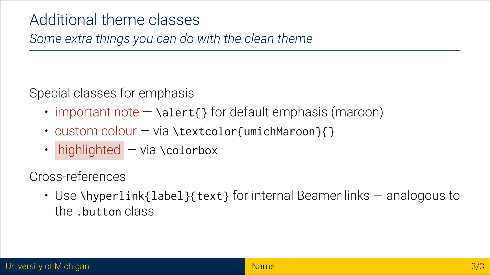
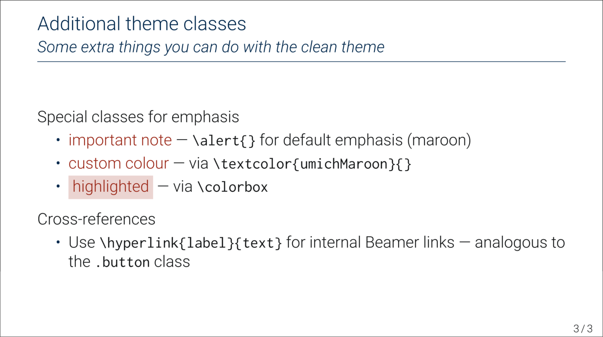

# University of Michigan Slides Templates

These templates were inspired and built from Grant McDermott and Kyle Butt's
clean theme, published under MIT license. This repository contains a beamer and
a revealjs template. The following sections describe the different templates 
and how to download them.

## Prerequisites

### Beamer

- A LaTeX distribution: [TeX Live](https://www.tug.org/texlive/) (Linux/macOS) or [MiKTeX](https://miktex.org/) (Windows)
- [`latexmk`](https://ctan.org/pkg/latexmk) for automatic compilation (included in TeX Live)

### Revealjs

- [Quarto](https://quarto.org/docs/get-started/)
- [R](https://www.r-project.org/) (optional, for embedding R code and figures)

## Beamer

There are two beamer templates: `beamerthemeumich.sty` and
`beamerthemeclean.sty`. The following images show the former template. The
latter template is identical, but removes the Michigan colored footer.

Users can run one of the following commands to clone the beamer templates

```bash
npx degit JozefRivest/umich-slides-template/beamer
```

or

```bash
git clone --filter=blob:none --sparse https://github.com/JozefRivest/umich-slides-template.git
cd umich-slides-template
git sparse-checkout set beamer
```

<table>
<tr>
  <th align="center">With Michigan footer</th>
  <th align="center">Without footer</th>
</tr>
<tr>
  <td></td>
  <td></td>
</tr>
<tr>
  <td></td>
  <td></td>
</tr>
<tr>
  <td></td>
  <td></td>
</tr>
</table>


Otherwise, you can copy the `beamerthemeumich.sty`, or the
`beamerthemeclean.sty` and the `presentation.tex` files into Overleaf or into
your local directory. You need both if you want to have the same output.

### Usage

To use the desired template, users have to specify which template they want 
to use in their `.tex` file

```tex
\documentclass[aspectratio=169, 12pt]{beamer}

\usetheme{umich} % For the template with the colored footer
%
\usetheme{clean} % For the clean template
```

**You have to specify only one of the two themes**.

## Revealjs

The revealjs template is made to work with Quarto. Quarto uses markdown syntax
and nice integration with `R`. So users can directly insert their code in their
presentation to create figures and tables. You can also source `R` scripts so 
you can insert only the object created for a plot into your `presentation.qmd`
file.


### Usage

If you would like to add the **clean** theme to an existing directory:

```bash
npx degit JozefRivest/umich-slides-template/reveal
```

or

```bash
git clone --filter=blob:none --sparse https://github.com/JozefRivest/umich-slides-template.git
cd umich-slides-template
git sparse-checkout set reveal
```
